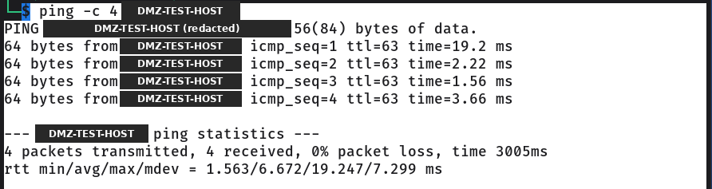
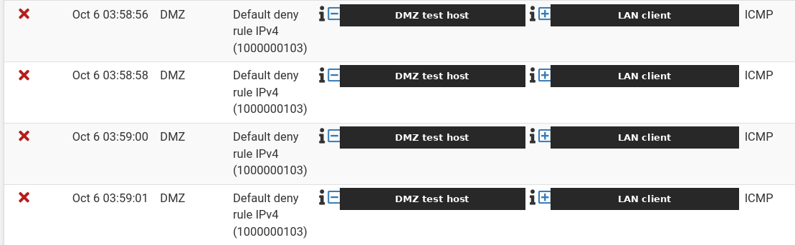
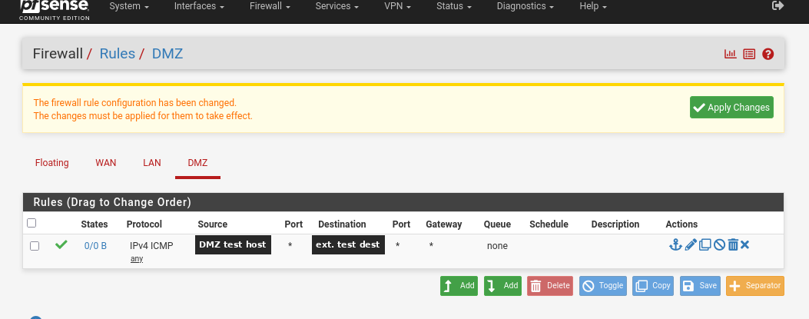

# Lab 03 — Firewall, DMZ and perimeter defense (in progress)

**Environment: REAL LAB.** This is not SCS SIMULATION content.

> Personal cybersecurity lab / training environment. Everything here runs on
> virtual machines I own, on isolated virtual networks. Not professional work
> experience. The hands-on work for this goal is in progress, not complete.

**Roadmap goal:** 3 — Firewall, DMZ and perimeter defense.
**Topics:** firewalls, stateful filtering, DMZ (demilitarized zone), network
segmentation, default deny, reading firewall logs.
**Tools:** pfSense CE (Community Edition) 2.7.2, ping, the pfSense firewall log.
**Status:** In progress. A firewall with separate LAN and DMZ segments is built
and the first tests are recorded. Two results still need to be verified.

---

## Objective
Build a firewall myself, split one flat lab network into separate segments, place
a DMZ, and show with tests and logs which traffic is allowed and which is blocked.
This is my first firewall build.

## Lab topology (sanitized)

```
          outside network (hypervisor NAT)
                        |
                 [ pfSense firewall ]
                  /                \
         LAN segment            DMZ segment
         LAN client             DMZ test host
```

- The firewall is a virtual machine with three network adapters, one per network.
- The LAN and the DMZ are separate virtual networks, each with its own subnet.
- The LAN client and the DMZ test host get their addresses from the firewall.
- Real addresses, interface names and host names are left out of this write-up.

## Firewall policy at this stage

| Path | Result | Basis |
|---|---|---|
| LAN client to DMZ test host | Allowed | Test 1 |
| DMZ test host to LAN client | Denied by the firewall's default deny rule | Test 2 and the firewall log |
| DMZ test host to the outside | One narrow rule added: ICMP (Internet Control Message Protocol) only, from the DMZ test host only, to one external test destination only | Test 3 |

The narrow rule is not general internet access for the DMZ. I have not yet
captured the full rule list for each interface.

## Tests and results

| # | Test | Result | Evidence | Status |
|---|---|---|---|---|
| 1 | Ping from the LAN client to the DMZ test host | 4 transmitted, 4 received, 0% packet loss | Screenshot 01 | Supported by screenshot |
| 2 | Ping from the DMZ test host to the LAN client (first attempt) | Denied. The firewall log shows four ICMP entries from the DMZ test host to the LAN client blocked by the default deny rule | Screenshot 02 | Supported by the firewall log. The ping output on the DMZ test host was not captured |
| 3 | Added a narrow DMZ rule for ICMP to one external test destination, applied it, then pinged that destination from the DMZ test host | Traffic was observed after the rule was applied. The exact received count was not captured | Screenshot 03 shows the rule as created, before it was applied | Observed, not fully recorded |
| 4 | Ping from the DMZ test host to the LAN client again, after the rule was added | Not confirmed | None | Needs verification |

## Evidence

Redacted copies only. Addresses are replaced with labels.

**01 — LAN client to DMZ test host: 4 of 4 replies**



**02 — Firewall log: DMZ test host to LAN client blocked by the default deny rule**



**03 — The narrow DMZ rule as created (taken before the change was applied)**



See the [evidence notes](evidence/README.md) for what each image shows and what
is still missing.

## What this shows, and what it does not

**Shows**
- A real firewall now separates a LAN segment and a DMZ segment in the lab.
- A host on the LAN could reach the DMZ test host.
- When the DMZ test host tried to reach the LAN client, the firewall blocked it
  and logged each attempt.
- A narrow rule for one protocol to one destination was created.

**Does not show yet**
- A recorded result for the narrow rule. Traffic was observed, but the count was
  not captured, and the screenshot predates applying the rule.
- That the DMZ-to-LAN block still held after the rule was added. That re-test
  needs to be repeated and captured.
- Anything beyond ping. Port-level tests and packet captures are still to do.
- Hands-on experience with a next-generation firewall (NGFW). I have not used
  one. NGFW concepts are part of my study for this goal only.

## Why this matters to a business (SCS SIMULATION context)

The SCS SIMULATION is a separate, fictional environment: a made-up casino and
resort. It does not represent any real company's systems.

In a resort like that, the public guest website has to be reachable from the
internet, while the systems that run sales, staff applications and guest data
do not. Putting the public-facing server in a DMZ means that if it is ever
compromised, it cannot start connections into the internal network. A narrow
outbound rule follows the same idea: allow the one path a system needs and
nothing broader.

The simulation models its own firewall rules for that fictional network. Those
rules are simulated. They do not enforce the real pfSense rules in this lab, and
this lab does not change the simulation.

## Next steps
- Repeat tests 3 and 4 and capture the full ping summary from the DMZ test host.
- Capture the rule list for each interface and write down why each rule exists.
- Repeat the allow and block tests with Nmap and Wireshark.
- Draw the before and after network diagram.
