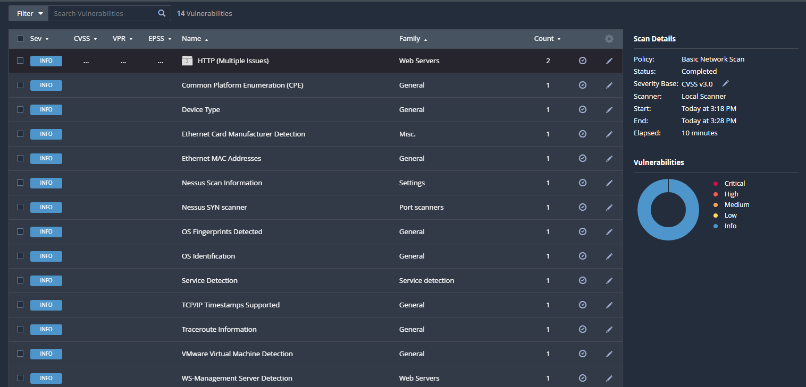
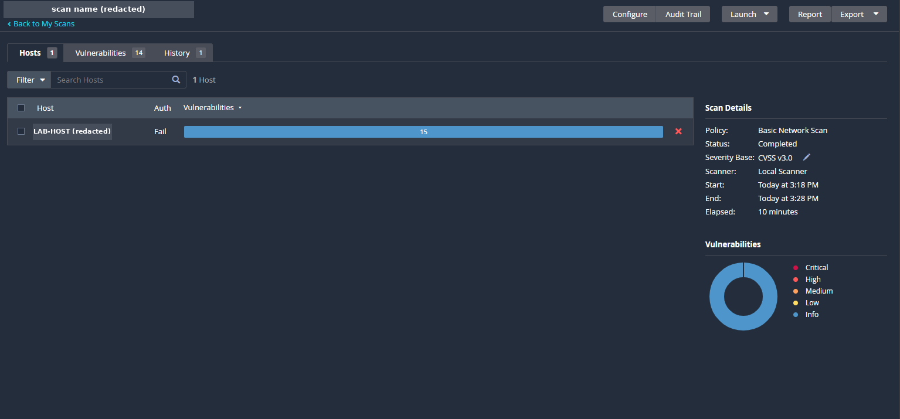

# Lab 04 — Vulnerability assessment: first Nessus scan (in progress)

**Environment: REAL LAB.** This is not SCS SIMULATION content.

> Personal cybersecurity lab / training environment. Everything here runs on
> virtual machines I own, on isolated virtual networks. Not professional work
> experience. The hands-on work for this goal is in progress, not complete.

**Roadmap goal:** 2 — Vulnerability assessment.
**Topics:** vulnerability scanning, severity levels, reading scan results, stating
the limits of a result.
**Tools:** Nessus Essentials, using the Basic Network Scan policy.
**Status:** In progress. My first Nessus Basic Network Scan is completed: one
host, with Nessus not logged in to it. The scanning-versus-sweeping comparison is
not done: no sweep was performed.

---

## Objective
Run a vulnerability scanner in my own lab, read the results correctly, and be
clear about what the result does and does not show. This is my first Nessus scan.

## What the screenshots show

| Item | Value shown |
|---|---|
| Policy | Basic Network Scan |
| Status | Completed |
| Scanner | Local Scanner |
| Severity base | CVSS (Common Vulnerability Scoring System) v3.0 |
| Start and end | 3:18 PM to 3:28 PM |
| Elapsed | 10 minutes |
| Hosts scanned | 1 |
| Auth column for that host | Fail |
| Listed entries | 14 |
| Severity of the entries | Info, on every row |
| Severity chart | Info only |

**The 14 listed entries**

| # | Name | Family | Count |
|---|---|---|---|
| 1 | HTTP (Multiple Issues) | Web Servers | 2 |
| 2 | Common Platform Enumeration (CPE) | General | 1 |
| 3 | Device Type | General | 1 |
| 4 | Ethernet Card Manufacturer Detection | Misc. | 1 |
| 5 | Ethernet MAC Addresses | General | 1 |
| 6 | Nessus Scan Information | Settings | 1 |
| 7 | Nessus SYN scanner | Port scanners | 1 |
| 8 | OS Fingerprints Detected | General | 1 |
| 9 | OS Identification | General | 1 |
| 10 | Service Detection | Service detection | 1 |
| 11 | TCP/IP Timestamps Supported | General | 1 |
| 12 | Traceroute Information | General | 1 |
| 13 | VMware Virtual Machine Detection | General | 1 |
| 14 | WS-Management Server Detection | Web Servers | 1 |

Nessus heads this list "Vulnerabilities", but every row here is rated Info. No
row is rated Low, Medium, High or Critical. The "HTTP (Multiple Issues)" row is a
group with a count of 2, which is why the Hosts view shows 15 for the one host.

The Auth column reads Fail: Nessus did not log in to the host. This was a scan
from the network only.

## Evidence

**01 — Nessus results list and scan details**

**02 — Nessus Hosts view: one host, Auth: Fail**

See the [evidence notes](evidence/README.md) for what each image shows and what
is still missing.

## What this shows, and what it does not

**Shows**
- One Basic Network Scan of one host ran to completion in 10 minutes.
- Nessus did not log in to that host (Auth: Fail).
- The results list has 14 entries, and all of them are rated Info.

**Does not show**
- That the host or the network is free of vulnerabilities. This result is not
  evidence of that. A scan that does not log in can only report what is visible
  from the network. It does not check installed software, missing patches or
  local settings on the host itself.
- Anything about other systems. Only one host was scanned.
- Which system was scanned, or the date. The screenshots show times only, and the
  host address is redacted.
- Any fix or remediation. None is claimed.

## Study-guide topic: vulnerability scanning versus vulnerability sweeping

| Part | Status |
|---|---|
| Vulnerability scanning | Started. One Basic Network Scan is completed (this lab) |
| Vulnerability sweeping | Not done. No sweep was performed |
| Comparing the two from my own work | Not done. It needs the sweep first |

## Why this matters to a business (SCS SIMULATION context)

The SCS SIMULATION is a separate, fictional environment: a made-up casino and
resort. It does not represent any real company's systems.

A scan report that lists only informational entries is easy to misread as "we
are secure". For a resort that takes payments and holds guest data, the useful
answer for management is what was checked, from where, and what the scan could
not see.

No Goal 2 scenario has been built in the simulation. The simulation does not run
Nessus, and simulated output is never REAL LAB evidence.

## Next steps
- Run a scan with credentials and compare it with this one.
- Perform a vulnerability sweep in the lab, then write the scanning-versus-sweeping
  comparison.
- Export the scan report.
